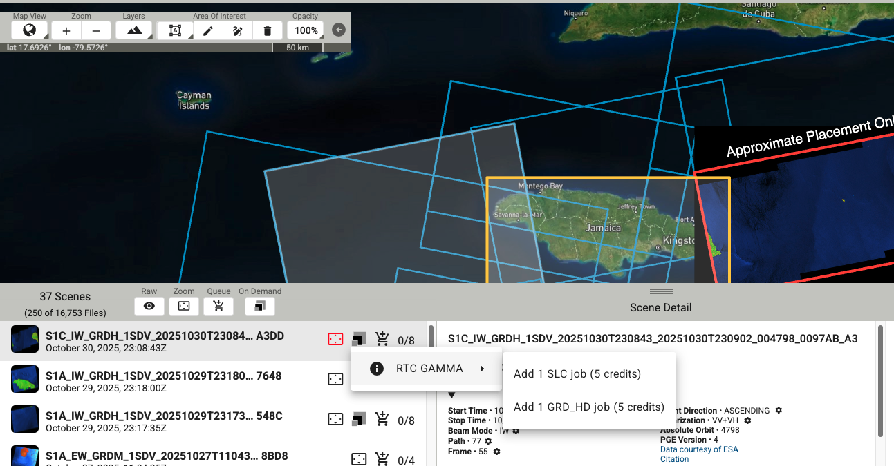

# Flood Detection Model

This repository contains a flood detection model that uses Synthetic Aperture Radar (SAR) imagery from the Planetary Computer to identify flooded areas. The model processes Sentinel-1 data and can be used for both local image pairs and large-scale analysis using Planetary Computer data.

## Table of Contents
- [Installation](#installation)
- [Usage](#usage)
  - [Planetary Computer Inference](#planetary-computer-inference)
  - [Local Image Inference](#local-image-inference)
  - [Additional post-model filtering](#additional-post-model-filtering)
- [Project Structure](#project-structure)
- [Model Details](#model-details)
- [Data](#data)
- [Contributing](#contributing)
- [Citation](#citation)

## Installation

1. Clone this repository:
   ```
   git clone https://github.com/microsoft/ai4g-flood.git
   cd ai4g-flood
   ```

2. Create a new virtual environment using Python<3.12 (optional but recommended):
   ```
   python -m venv venv
   source venv/bin/activate  # On Windows, use `venv\Scripts\activate`
   ```

3. Install the required packages:
   ```
   pip install -r requirements.txt
   ```

4. Install the package in editable mode:
   ```
   pip install -e .
   ```


Alternatively, you can use `conda` to create an environment:
```
conda env create -f environment.yml
conda activate ai4g-flood
```


## Usage

### Planetary Computer Inference

To run inference using images from the Planetary Computer:

```bash
python src/run_flood_detection_planetary_computer.py \
    --region "your_region" \  # should be a country from ne_110m_admin_0_countries.shp, see src/data/country_boundaries
    --start_date "2023-01-01" \
    --end_date "2023-12-31" \
    --model_path "models/ai4g_sar_model.ckpt" \
    --output_dir "path/to/output/directory" \
    --batch_size 1 \
    --input_size 128 \
    --device_index 0 \
    --buffer_size 8 # Optional: Buffer size in pixels to apply to the flood prediction.
```
The --buffer_size argument applies a buffer to the flood predictions, in pixels. If you want to follow the methodology in the paper, you would need to run with an 80-meter buffer.

There's also a way to run the model so that you don't need the buffer and let the neural net 'fill in' the flood extent. If you want to use this you can use the `--keep_all_predictions` parameter and set the `buffer_size` to 0. This is somewhat experimental, but often matches the underlying SAR data better without the need of the 80-meter buffer.

This will create a directory structure like:
```
results/
├── 2023/
│   ├── 01/
│   │   ├── 01/
│   │   │   ├── file1_flood_prediction.tif
│   │   │   └── file2_flood_prediction.tif
│   │   └── 02/
│   └── 02/
```

These individual GeoTIFF files:
- May have different coordinate reference systems (CRS)
- Can overlap spatially
- Contain flood predictions with values of 255 (flood) and np.NaN (no flood/no data)

#### Merging Results

After running flood detection, you can merge all the individual prediction files into a single consolidated raster:

```bash
python src/merge.py \
    --input_root results \
    --output merged_flood_predictions.tif
```

This will:
- Project all rasters to EPSG:3857 (Web Mercator)
- Merge overlapping areas using the maximum flood confidence
- Convert values: np.nan → 0 (no flood), 255 → 1 (flood)
- Save with ZSTD compression and tiling

### Local Image Inference

#### Downloading images

You can download images from planetary computer, or any other Sentinel-1 imagery provided. **Important:** This model was trained on Sentinel-1 RTC data from the Microsoft Planetary Computer sourced from Catalyst. RTC data includes radiometric calibration, terrain correction, and other custom data processing by Catalyst. If you use other sources (e.g., ASF, Copernicus Hub), ensure similar preprocessing steps are applied. Results may differ if preprocessing is inconsistent.

However, the model will still work with data retrieved from other sources. For example, here's how to download images from the Alaska Satellite Facility (ASF) (https://search.asf.alaska.edu/).

First, you can use the geographic and temporal search function to identify the Sentinel-1 images you want to download - remember, you need a pre and a post image. Ideally you should choose images from the same satellite (S1A or S1C as of Nov 2025) and the same time of day to reduce any observational artifacts that mimic flooding. Once you have found your images, you have to select each image for further processing - the raw values in the GRD file are not calibrated and therefore are not suitable for ingestion into the model. You can do this manually in a tool like ESA SNAP or use the ASF pipeline, as shown below. 

First, click on the icon with three squares and then click 'RTC Gamma' and add the GRD_HD Job.
<p align="center">
  
</p>


Next, click on the 'On Demand' icon at the top and go to the 'On Demand Queue'. You **must** use gamma0 for radiometry and power for the scale. It is **recommended** to apply DEM Matching and Speckle filtering. For pixel spacing, 10 meters is the highest resolution but the processing will take longer.
<p align="center">
  
</p>

Once the jobs are complete, you can download and unzip the files and get the pre and post VV and VH tif files for running the model on downloaded image pairs. 


#### Running the model

To run inference on local image pairs:

```bash
python src/run_flood_detection_downloaded_images.py \
    --pre_vv "path/to/pre_vv.tif" \
    --pre_vh "path/to/pre_vh.tif" \
    --post_vv "path/to/post_vv.tif" \
    --post_vh "path/to/post_vh.tif" \
    --model_path "./models/ai4g_sar_model.ckpt" \
    --output_dir "local_results" \
    --output_name "flood_prediction.tif"
```

### Additional post-model filtering

The model may generate false positives in permanent water bodies. To remove those, you will need to filter out permanent water pixels after running the model. There are several appropriate options, including ESRI Land Cover mappings (https://livingatlas.arcgis.com/landcover/), ESA World Cover (https://esa-worldcover.org/en) or Global Surface Water (https://global-surface-water.appspot.com/). These data sources are also available via the Microsoft Planetary Computer (https://planetarycomputer.microsoft.com/explore).

## Project Structure

```
ai4g-flood/
│
├── src/
│   ├── utils/
│   │   ├── flood_dataset.py
│   │   ├── flood_data_module.py
│   │   ├── image_processing.py
│   │   └── model.py
│   │
│   ├── data/
│   │   ├── region_polygons.py
│   │   └── country_boundaries/
│   │
│   ├── run_flood_detection_planetary_computer.py
│   ├── run_flood_detection_downloaded_images.py
│   └── merge.py
│
├── models/
│   └── ai4g_sar_model.ckpt
│
├── requirements.txt
└── README.md
```

## Model Details

The flood detection model is based on a U-Net architecture with a MobileNetV2 encoder. It takes SAR imagery (VV and VH polarizations) as input and produces binary flood maps.

## Data

The model uses Sentinel-1 SAR data accessed through the Microsoft Planetary Computer. The `FloodDataModule` class handles data retrieval and preprocessing.

## Contributing

Contributions to this project are welcome. Please fork the repository and submit a pull request with your changes.

## Citation

If you use find this work useful, please cite our [Nature Communications paper](https://www.nature.com/articles/s41467-025-60973-1), or on [arxiv](https://arxiv.org/abs/2411.01411).

Bibtex:
```
@article{misra2025mapping,
  title={Mapping global floods with 10 years of satellite radar data},
  author={Misra, Amit and White, Kevin and Nsutezo, Simone Fobi and Straka III, William and Lavista, Juan},
  journal={Nature Communications},
  volume={16},
  number={1},
  pages={5762},
  year={2025},
  publisher={Nature Publishing Group UK London}
}
```
